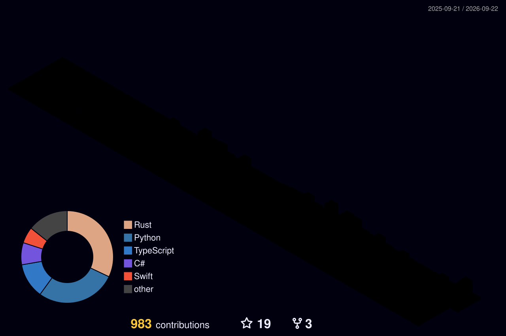

## Hi there 👋

<table>
  <tr>
    <td width="60" align="center">
      
    </td>
    <td>
      <a href="https://ioridram.com"><b>Iori's Profile</b></a> 
      ioriのポートフォリオ・ブログサイト。プログラミングや日常のことについて書いています。 
      <code>https://ioridram.com</code>
    </td>
  </tr>
</table>

### 📚 Studying

### 🧊 3D Contribution Graph

